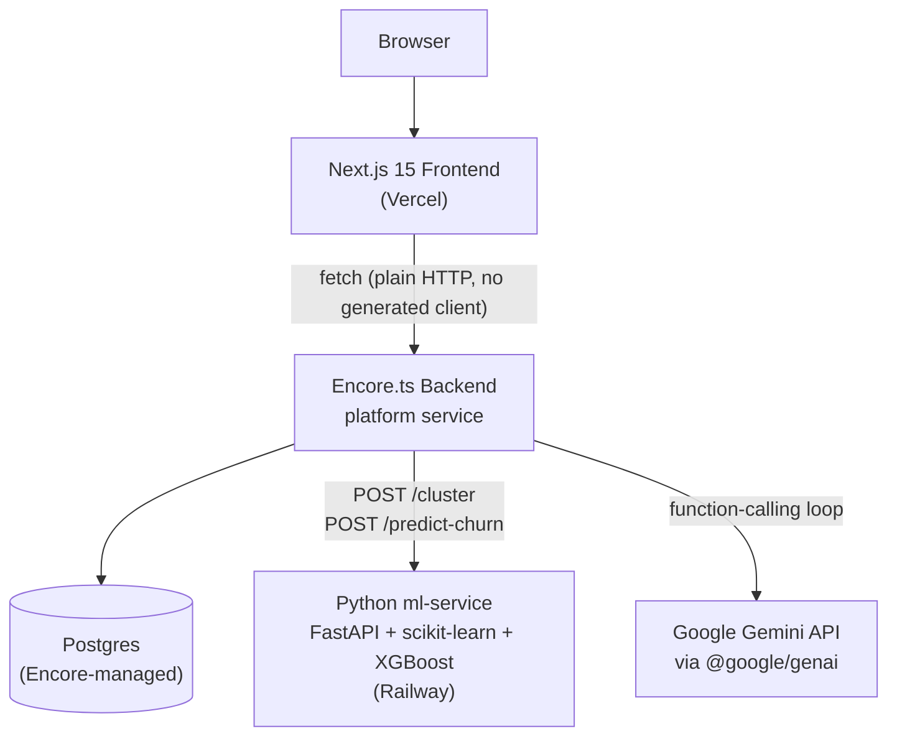

# Architecture

## Service topology

## Why these boundaries exist

- **Frontend and backend are separate services** so the frontend can deploy to
  Vercel's edge network while the backend owns a real Postgres database —
  Encore provisions and manages this database directly, no external DB host.
- **ml-service is a separate Python service** because Encore.ts doesn't support
  Python, and real clustering (scikit-learn's `KMeans`) and classification
  (XGBoost) need Python's ML ecosystem. It's stateless — Encore sends it
  feature vectors over HTTP and persists the results itself; the ml-service
  never owns data.
- **The AI Copilot calls Gemini directly from the backend**, not through
  ml-service, since it's a function-calling *loop* (multiple round-trips per
  question) rather than a single stateless prediction call — keeping it in
  TypeScript alongside the tool functions it calls (Phases 2-6's own
  endpoints) avoids a second HTTP hop for every tool invocation.

## Request flow: a Customer Segmentation page load

1. `/segments` (Server Component) calls `getCustomerSegments()` → `fetch`
2. Backend's `customerSegments` endpoint calls `ensureSegmented()`
3. First time only: fetches all companies' 5-feature vectors, `POST /cluster`
   to ml-service (real k-means), computes deterministic persona labels/drivers
   in TypeScript, persists to `ml_predictions`
4. Subsequent calls: reads the persisted rows directly, no ml-service round
   trip
5. Returns 4 segment summaries to the page

## Request flow: an AI Copilot question

1. `/copilot` (the only page-level Client Component — SSE needs client-side
   `fetch`+`ReadableStream`) POSTs `{messages: [...]}` to `POST /chat`
2. The backend's function-calling loop (`agent.ts`) sends the conversation to
   Gemini with 5 tool declarations
3. Gemini decides whether to call a tool; if so, the loop dispatches to a real
   in-process function (`chatTools.ts`) wrapping this project's own existing
   endpoints — never a separate "AI data layer"
4. The tool's real result is fed back to Gemini, which produces a grounded
   final answer, streamed back over SSE
