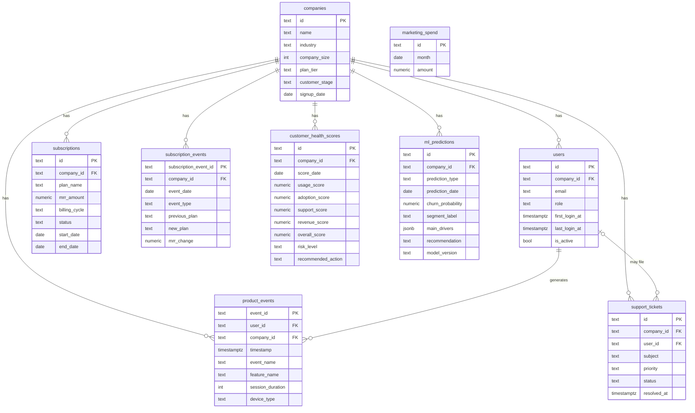

# Database Schema

9 tables, all owned by the `platform` Encore service (native Encore-managed
Postgres, no external DB host). Full source of truth:
`backend/platform/migrations/1_schema.up.sql` and `2_marketing_spend.up.sql`.

## Entity-relationship diagram

(`marketing_spend` has no foreign key — it's a standalone monthly-total table
used for CAC, not scoped to any one company.)

## Table reference

### `companies`
Core B2B account record. `plan_tier` (free/starter/professional/enterprise) and
`customer_stage` (trial/onboarding/active/growing/power_user/at_risk/churned)
are both constrained by CHECK. Populated by Phase 1's seed script (1000 rows).

### `users`
Individual seats within a company. `first_login_at`/`last_login_at` drive
activation-funnel and engagement metrics. Populated by Phase 1 (5000 rows).

### `subscriptions`
Current billing state per company. `status`
(active/canceled/trialing/past_due) is the actual churn signal used everywhere
in this project — a company is "churned" when `status='canceled' AND
end_date<=now()`. Populated by Phase 1.

### `subscription_events`
Append-only billing lifecycle log (new_subscription/upgrade/downgrade/
cancellation/renewal) — what makes the MRR waterfall and revenue-change
analysis computable without re-deriving state from `subscriptions` snapshots.
Populated by Phase 1.

### `product_events`
Usage tracking — every dashboard view, report export, feature use, etc. Drives
DAU/WAU/MAU, the activation funnel, feature adoption, and the usage component
of health scoring. ~100,000 rows, populated by Phase 1.

### `support_tickets`
Feeds the support component of health scoring and the churn model's
`support_score` feature. Populated by Phase 1.

### `customer_health_scores`
**Stays empty by design** — not an oversight. Phase 4 (Customer Intelligence)
originally designed this as a persisted time series, but decided to compute
health scores live in the API instead (matching every other metric in this
project's "compute live from raw data" pattern) since only a *current* score
was ever actually needed. Real history/trending could be added later by
starting to write to this table; it's out of scope today.

### `ml_predictions`
Output of the two real ML pipelines, written back by Encore after calling
ml-service. One row per active company per `prediction_type`:
- `prediction_type='segment'` (Phase 5) — `segment_label` set,
  `churn_probability` null
- `prediction_type='churn_probability'` (Phase 6) — `churn_probability` and
  `recommendation` set, `segment_label` null
- `main_drivers` (JSONB) holds the full feature vector, drivers, and model run
  metadata for both prediction types — denormalized per row rather than a
  separate run-metadata table, since Postgres's JSONB fits this fine at this
  scale.

### `marketing_spend`
Monthly marketing spend total, feeding CAC. Populated by Phase 2's seed
generator, correlated with real new-paying-customer counts from
`subscription_events`.
