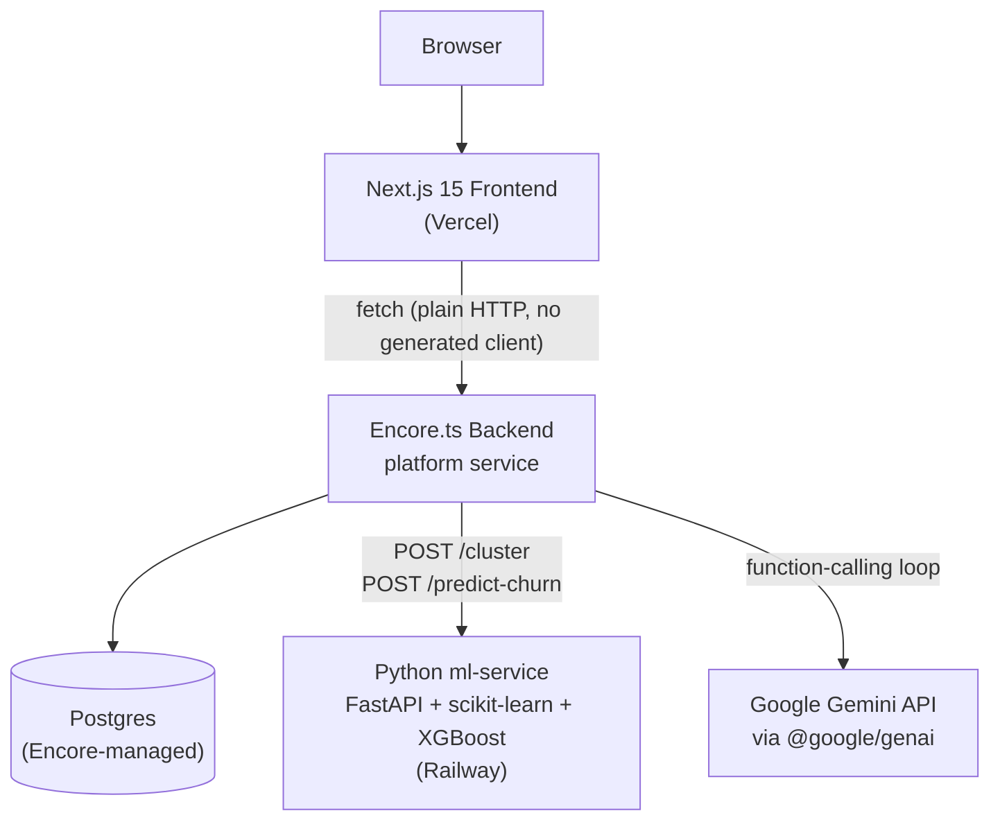
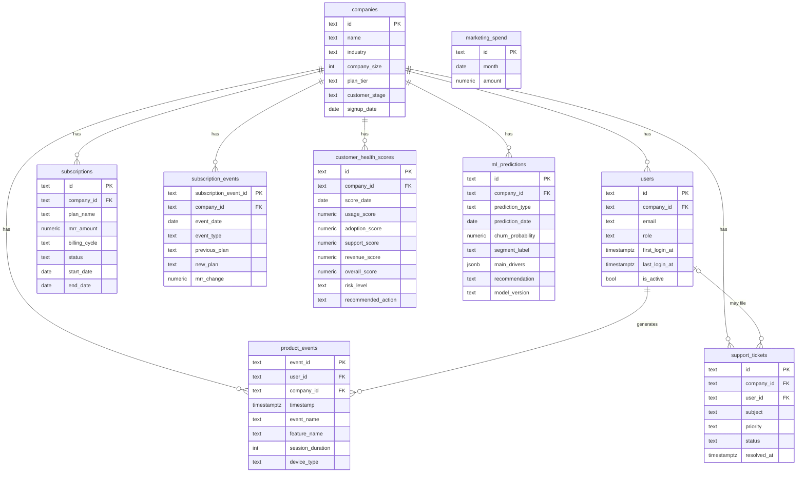

# SaaSPulse AI — Phase 8: Polish Implementation Plan

> **For agentic workers:** REQUIRED SUB-SKILL: Use superpowers:subagent-driven-development (recommended) or superpowers:executing-plans to implement this plan task-by-task. Steps use checkbox (`- [ ]`) syntax for tracking.

**Goal:** Bring documentation and portfolio materials up to date with the fully-built 6-module product, without deploying anything.

**Architecture:** This phase is documentation and content, not code — there is no TDD cycle. Each task's verification step is **factual accuracy checking**: every concrete claim gets cross-checked against the actual current codebase (schema files, `api.ts`, `chat.ts`) rather than against a test assertion.

**Tech Stack:** Markdown, Mermaid (renders natively on GitHub), a published HTML Artifact for the project presentation.

## Global Constraints

- **No deployment executed.** `DEPLOY.md` is updated as instructions only.
- **Every factual claim (endpoint path, table/column name, tech version, formula) must be verified against the real current code**, not recalled from memory or from this plan alone — the plan's content below was written from real reads of the actual files, but the implementer must re-verify before committing, since the plan itself could still contain a transcription slip.
- **Mermaid diagrams**, not standalone image files, for both the architecture diagram and the ER diagram.
- **The presentation artifact uses real Playwright screenshots** of the actual running app (all 6 module pages), never placeholder/mockup images or written descriptions standing in for visuals.
- Real tech versions in use (verify these haven't drifted before writing them into docs): Next.js `15.5.22`, React `19.1.0`, Tailwind `^4`, Encore.ts `^1.57.13`, `@google/genai` `^2.11.0`, scikit-learn `1.5.2`, XGBoost `2.1.1`.
- Real endpoint count: 10 (9 in `api.ts` + `POST /chat` in `chat.ts`). Real table count: 9 (8 in `1_schema.up.sql` + `marketing_spend` in `2_marketing_spend.up.sql`).

---

## File Structure

- `README.md` (modify) — full overhaul
- `docs/ARCHITECTURE.md` (new) — Mermaid service-topology diagram + explanation
- `docs/DATABASE.md` (new) — Mermaid ER diagram + per-table reference
- `docs/API.md` (new) — endpoint reference
- `DEPLOY.md` (modify) — fix stale ml-service note, add prod secret step
- `docs/PORTFOLIO.md` (new) — LinkedIn description + resume bullets
- Published HTML Artifact — project presentation (not a repo file; published via the Artifact tool)

---

### Task 1: README.md overhaul

**Files:**
- Modify: `README.md`

**Interfaces:** None (standalone content task).

- [ ] **Step 1: Verify the facts this file will state**

Before writing, confirm against the real repo:
- `frontend/app/` contains exactly these page directories (routes):
  `dashboard`, `product`, `customers`, `segments`, `churn-risk`, `copilot`
- `frontend/package.json` has `"next": "15.5.22"`, `"react": "19.1.0"`,
  `"tailwindcss": "^4"`
- `backend/package.json` has `"encore.dev": "^1.57.13"`, `"@google/genai": "^2.11.0"`
- `ml-service/requirements.txt` has `scikit-learn==1.5.2`, `xgboost==2.1.1`

If any of these have changed since this plan was written, use the real current
values instead — do not commit stale version numbers.

- [ ] **Step 2: Replace the full contents of `README.md`**

```markdown
# SaaSPulse AI

An AI-powered SaaS Product Analytics & Growth Intelligence Platform — a portfolio
project demonstrating a production-shaped, full-stack SaaS analytics product.
All data is synthetic.

## What it does

SaaSPulse AI gives a SaaS company's leadership, product, and customer success
teams one place to see how the business is doing, powered by real machine
learning and a conversational AI analyst:

1. **Executive Command Center** (`/dashboard`) — MRR, ARR, CAC, CLV, churn rate,
   NRR, revenue trend, MRR waterfall, customer growth, subscription breakdown.
2. **Product Analytics** (`/product`) — DAU/WAU/MAU, stickiness, feature
   adoption, a 5-stage activation funnel, feature usage ranking, engagement
   trend, cohort retention.
3. **Customer Intelligence** (`/customers`) — a 0-100 health score per active
   company (usage/adoption/support/revenue sub-scores), risk level, and a
   deterministic recommended action.
4. **Customer Segmentation** (`/segments`) — real k-means clustering
   (scikit-learn) groups active companies into 4 personas: Power Users,
   Expansion Opportunity, High Value/Low Engagement, and At Risk.
5. **Churn Prediction** (`/churn-risk`) — a real XGBoost classifier trained on
   actual churn outcomes, with validated held-out accuracy/precision/recall/AUC,
   predicting each active company's churn probability with explainable drivers.
6. **AI Analyst Copilot** (`/copilot`) — a Google Gemini-powered chat assistant
   that answers business questions by calling the platform's own real endpoints
   as tools (never fabricating numbers), including looking up any single
   company by name.

## Architecture

- `backend/` — Encore.ts, single `platform` service, owns Postgres (native
  Encore-managed SQL DB + migrations). See `backend/platform/`.
- `frontend/` — Next.js 15.5 + React 19 + TypeScript + Tailwind v4 + shadcn/ui,
  deployed to Vercel (see `DEPLOY.md`).
- `ml-service/` — Python + FastAPI + scikit-learn + XGBoost, deployed to
  Railway. Called by the backend for customer segmentation (`POST /cluster`)
  and churn prediction (`POST /predict-churn`).
- `docs/superpowers/` — specs and implementation plans for each of this
  project's 8 build phases.
- `docs/ARCHITECTURE.md` — service topology diagram and explanation.
- `docs/DATABASE.md` — full schema reference with an ER diagram.
- `docs/API.md` — every endpoint's method/path/params/response shape.

## Local development

Start in this order — the backend's segmentation and churn-prediction
endpoints call the ml-service on first request.

ml-service:

```bash
cd ml-service
python3 -m venv .venv && source .venv/bin/activate
pip install -r requirements.txt
uvicorn main:app --reload --port 8001
```

Backend:

```bash
cd backend
npm install
encore secret set --type dev,local GeminiApiKey   # needed for the AI Copilot; get a key at https://aistudio.google.com/apikey
encore run
```

The `platform` service self-seeds 1000 companies / 5000 users / 100,000 product
events on first request (see `backend/platform/seed.ts`). Customer segmentation
and churn prediction also self-train on first request against the real
ml-service (see `backend/platform/segmentation.ts` and
`backend/platform/churnPrediction.ts`).

Frontend:

```bash
cd frontend
npm install
cp .env.local.example .env.local
npm run dev
```

Visit `http://localhost:3000/dashboard` (and `/product`, `/customers`,
`/segments`, `/churn-risk`, `/copilot`).

## Tests

```bash
cd backend && encore test
cd frontend && npx tsc --noEmit
cd ml-service && source .venv/bin/activate && pytest
```

The AI Copilot's 2 real end-to-end Gemini tests are gated behind an env var so a
plain `encore test` never spends Gemini's rate-limited free-tier quota:

```bash
cd backend && RUN_GEMINI_TESTS=1 encore test chat.test.ts
```

## Deployment

Not yet deployed — see `DEPLOY.md` for the (unexecuted) deployment plan.
```

- [ ] **Step 3: Verify**

Re-read the committed file and confirm every route, file path, and version
number mentioned matches what Step 1 confirmed. Render the markdown locally
(or trust GitHub's renderer) and confirm no broken formatting.

- [ ] **Step 4: Commit**

```bash
cd "/Users/chandanagowda/Desktop/SaasPluseAI"
git add README.md
git commit -m "docs: overhaul README for all 6 shipped modules"
```

---

### Task 2: Architecture documentation (`docs/ARCHITECTURE.md`)

**Files:**
- Create: `docs/ARCHITECTURE.md`

**Interfaces:** None.

- [ ] **Step 1: Verify the facts this file will state**

Confirm against the real code:
- `frontend/lib/api.ts` uses plain `fetch` (no generated Encore client) —
  grep for `generateClient` or similar to confirm none exists.
- `backend/platform/mlClient.ts` calls `POST /cluster` and `POST /predict-churn`
  on the ml-service.
- `backend/platform/gemini.ts` calls the Gemini API via `@google/genai`.
- `backend/platform/segmentation.ts`'s `ensureSegmented()` and
  `backend/platform/churnPrediction.ts`'s `ensureChurnPredicted()` are both
  idempotent (DB-level guard, only recompute once).

- [ ] **Step 2: Write the full file**

```markdown
# Architecture

## Service topology



## Why these boundaries exist

- **Frontend and backend are separate services** so the frontend can deploy to
  Vercel's edge network while the backend owns a real Postgres database —
  Encore provisions and manages this database directly, no external DB host.
- **ml-service is a separate Python service** because Encore.ts doesn't support
  Python, and real clustering (scikit-learn's `KMeans`) and classification
  (XGBoost) need Python's ML ecosystem. It's stateless — Encore sends it
  feature vectors over HTTP and persists the results itself; the ml-service
  never owns data.
- **The AI Copilot calls Gemini directly from the backend**, not through
  ml-service, since it's a function-calling *loop* (multiple round-trips per
  question) rather than a single stateless prediction call — keeping it in
  TypeScript alongside the tool functions it calls (Phases 2-6's own
  endpoints) avoids a second HTTP hop for every tool invocation.

## Request flow: a Customer Segmentation page load

1. `/segments` (Server Component) calls `getCustomerSegments()` → `fetch`
2. Backend's `customerSegments` endpoint calls `ensureSegmented()`
3. First time only: fetches all companies' 5-feature vectors, `POST /cluster`
   to ml-service (real k-means), computes deterministic persona labels/drivers
   in TypeScript, persists to `ml_predictions`
4. Subsequent calls: reads the persisted rows directly, no ml-service round
   trip
5. Returns 4 segment summaries to the page

## Request flow: an AI Copilot question

1. `/copilot` (the project's only Client Component — SSE needs client-side
   `fetch`+`ReadableStream`) POSTs `{messages: [...]}` to `POST /chat`
2. The backend's function-calling loop (`agent.ts`) sends the conversation to
   Gemini with 5 tool declarations
3. Gemini decides whether to call a tool; if so, the loop dispatches to a real
   in-process function (`chatTools.ts`) wrapping this project's own existing
   endpoints — never a separate "AI data layer"
4. The tool's real result is fed back to Gemini, which produces a grounded
   final answer, streamed back over SSE
```

- [ ] **Step 3: Verify**

Re-read the file and confirm the Mermaid syntax is valid (no unclosed
brackets/quotes) and that every claim in the "why these boundaries exist" and
"request flow" sections matches the real code checked in Step 1.

- [ ] **Step 4: Commit**

```bash
cd "/Users/chandanagowda/Desktop/SaasPluseAI"
git add docs/ARCHITECTURE.md
git commit -m "docs: add architecture diagram and service topology explanation"
```

---

### Task 3: Database documentation (`docs/DATABASE.md`)

**Files:**
- Create: `docs/DATABASE.md`

**Interfaces:** None.

- [ ] **Step 1: Verify the facts this file will state**

Read `backend/platform/migrations/1_schema.up.sql` and
`backend/platform/migrations/2_marketing_spend.up.sql` in full and confirm
every table name, column name, column type, CHECK constraint, and foreign key
listed below matches exactly. If the schema has changed since this plan was
written, use the real current schema instead.

- [ ] **Step 2: Write the full file**

```markdown
# Database Schema

9 tables, all owned by the `platform` Encore service (native Encore-managed
Postgres, no external DB host). Full source of truth:
`backend/platform/migrations/1_schema.up.sql` and `2_marketing_spend.up.sql`.

## Entity-relationship diagram



(`marketing_spend` has no foreign key — it's a standalone monthly-total table
used for CAC, not scoped to any one company.)

## Table reference

### `companies`
Core B2B account record. `plan_tier` (free/starter/professional/enterprise) and
`customer_stage` (trial/onboarding/active/growing/power_user/at_risk/churned)
are both constrained by CHECK. Populated by Phase 1's seed script (1000 rows).

### `users`
Individual seats within a company. `first_login_at`/`last_login_at` drive
activation-funnel and engagement metrics. Populated by Phase 1 (5000 rows).

### `subscriptions`
Current billing state per company. `status`
(active/canceled/trialing/past_due) is the actual churn signal used everywhere
in this project — a company is "churned" when `status='canceled' AND
end_date<=now()`. Populated by Phase 1.

### `subscription_events`
Append-only billing lifecycle log (new_subscription/upgrade/downgrade/
cancellation/renewal) — what makes the MRR waterfall and revenue-change
analysis computable without re-deriving state from `subscriptions` snapshots.
Populated by Phase 1.

### `product_events`
Usage tracking — every dashboard view, report export, feature use, etc. Drives
DAU/WAU/MAU, the activation funnel, feature adoption, and the usage component
of health scoring. ~100,000 rows, populated by Phase 1.

### `support_tickets`
Feeds the support component of health scoring and the churn model's
`support_score` feature. Populated by Phase 1.

### `customer_health_scores`
**Stays empty by design** — not an oversight. Phase 4 (Customer Intelligence)
originally designed this as a persisted time series, but decided to compute
health scores live in the API instead (matching every other metric in this
project's "compute live from raw data" pattern) since only a *current* score
was ever actually needed. Real history/trending could be added later by
starting to write to this table; it's out of scope today.

### `ml_predictions`
Output of the two real ML pipelines, written back by Encore after calling
ml-service. One row per active company per `prediction_type`:
- `prediction_type='segment'` (Phase 5) — `segment_label` set,
  `churn_probability` null
- `prediction_type='churn_probability'` (Phase 6) — `churn_probability` and
  `recommendation` set, `segment_label` null
- `main_drivers` (JSONB) holds the full feature vector, drivers, and model run
  metadata for both prediction types — denormalized per row rather than a
  separate run-metadata table, since Postgres's JSONB fits this fine at this
  scale.

### `marketing_spend`
Monthly marketing spend total, feeding CAC. Populated by Phase 2's seed
generator, correlated with real new-paying-customer counts from
`subscription_events`.
```

- [ ] **Step 3: Verify**

Diff every table/column name in the file above against a fresh read of both
migration files. Confirm the Mermaid `erDiagram` syntax is valid.

- [ ] **Step 4: Commit**

```bash
cd "/Users/chandanagowda/Desktop/SaasPluseAI"
git add docs/DATABASE.md
git commit -m "docs: add database schema reference with ER diagram"
```

---

### Task 4: API documentation (`docs/API.md`)

**Files:**
- Create: `docs/API.md`

**Interfaces:** None.

- [ ] **Step 1: Verify the facts this file will state**

Read `backend/platform/api.ts` and `backend/platform/chat.ts` in full and
confirm every method, path, param, and response field listed below matches
exactly (including which fields are optional, which are required, and the
`GET /customers/segments` fixed-order contract). If the endpoints have changed
since this plan was written, use the real current signatures instead.

- [ ] **Step 2: Write the full file**

```markdown
# API Reference

All endpoints are served by the Encore `platform` service (default local URL
`http://localhost:4000`). None require authentication — this is a portfolio
demo. For live, interactive docs generated directly from the running service,
use Encore's local dashboard (its URL is printed in the terminal when you run
`encore run`, typically `http://localhost:9400`) — that's the authoritative
source; this file is a static reference that can drift if endpoints change
without this doc being updated.

## Foundation

### `GET /health`
Health check. Response: `{ status: "ok" }`

### `GET /companies/count`
Response: `{ total_companies: number, active_companies: number, churned_companies: number }`

### `GET /companies`
Params (all optional, query string): `page: number`, `pageSize: number` (max
100), `planTier: string`, `industry: string`
Response: `{ companies: [{ id, name, industry, plan_tier, customer_stage, mrr }], total: number }`

## Executive Command Center (Module 1)

### `GET /metrics/executive-overview`
No params. Response:
```json
{
  "kpis": {
    "mrr": 0, "arr": 0, "revenue_growth_pct": 0, "customer_count": 0,
    "cac": 0, "clv": 0, "churn_rate_pct": 0, "nrr_pct": 0
  },
  "charts": {
    "revenue_trend": [{ "month": "2026-01", "mrr": 0 }],
    "mrr_waterfall": {
      "starting_mrr": 0, "new_mrr": 0, "expansion_mrr": 0,
      "contraction_mrr": 0, "churned_mrr": 0, "ending_mrr": 0
    },
    "customer_growth": [{ "month": "2026-01", "active_customers": 0 }],
    "subscription_breakdown": [{ "plan_tier": "free", "count": 0, "mrr": 0 }]
  }
}
```

## Product Analytics (Module 2)

### `GET /metrics/product-overview`
No params. Response:
```json
{
  "kpis": { "dau": 0, "wau": 0, "mau": 0, "stickiness_pct": 0, "feature_adoption_pct": 0 },
  "funnel": [{ "stage": "signup", "count": 0 }],
  "charts": {
    "feature_usage_ranking": [{ "feature_name": "dashboard", "event_count": 0 }],
    "engagement_trend": [{ "date": "2026-07-01", "dau": 0, "wau": 0, "mau": 0 }],
    "cohort_retention": [{ "cohort_month": "2026-01", "months_since_signup": 0, "retention_pct": 0 }]
  }
}
```

## Customer Intelligence (Module 3)

### `GET /customers/health-scores`
Params: `page: number`, `pageSize: number` (max 100)
Response: `{ customers: [{ company_id, company_name, plan_tier, usage_score, adoption_score, support_score, revenue_score, overall_score, risk_level, recommended_action }], total: number }`
Active companies only (excludes churned).

## Customer Segmentation (Module 4)

### `GET /customers/segments`
No params — always returns all 4 personas, in fixed order (Power Users,
Expansion Opportunity, High Value/Low Engagement, At Risk), never sorted by
size.
Response: `{ segments: [{ segment_label, company_count, pct_of_total, avg_usage_score, avg_adoption_score, avg_support_score, avg_revenue_score, avg_seat_penetration_score }] }`

## Churn Prediction (Module 5)

### `GET /customers/churn-risk`
Params: `page: number`, `pageSize: number` (max 100)
Response: `{ companies: [{ company_id, company_name, churn_probability, risk_level, primary_risk_driver, secondary_risk_driver, recommendation }], total: number }`
Active companies only, sorted by `churn_probability` descending (highest risk
first).

## AI Analyst Copilot (Module 6)

### `GET /companies/profile?name=`
Params (required): `name: string` — case-insensitive exact match first, falls
back to a partial match.
Response (found): `{ found: true, company: { id, name, industry, plan_tier, health: {...}, segment_label, churn: {...} } }`
Response (not found): `{ found: false, company: null }`

### `POST /chat`
Body: `{ messages: [{ role: "user"|"model", text: string }] }` — must end with
a `user` message; the client resends up to the last 20 messages each turn
(this project keeps no server-side chat history).

Response: Server-Sent Events (`Content-Type: text/event-stream`), one JSON
object per `data:` line:
- `{"type":"step","tool":"...","label":"..."}` — a tool is being called
- `{"type":"text","text":"..."}` — a streamed answer text chunk
- `{"type":"error","message":"..."}` — a failure occurred
- `{"type":"done"}` — stream complete (always sent, even after an error)
```

- [ ] **Step 3: Verify**

Diff every method/path/field in the file against a fresh read of `api.ts` and
`chat.ts`. Confirm the `customerSegments` fixed-order claim by re-reading the
`SEGMENT_ORDER` constant in `api.ts`.

- [ ] **Step 4: Commit**

```bash
cd "/Users/chandanagowda/Desktop/SaasPluseAI"
git add docs/API.md
git commit -m "docs: add API endpoint reference"
```

---

### Task 5: DEPLOY.md update

**Files:**
- Modify: `DEPLOY.md`

**Interfaces:** None.

- [ ] **Step 1: Verify the facts this file will state**

Confirm `backend/platform/mlClient.ts` exists and is the file that calls the
ml-service (so the "ML_SERVICE_URL environment variable" instruction points at
something real). Confirm no deployment has actually been executed (no
`encore.app` pointing at a real cloud app ID beyond a placeholder, no Vercel
project linked) — if this assumption is wrong, stop and ask rather than
guessing, since this task's whole framing depends on nothing being deployed
yet.

- [ ] **Step 2: Replace the full contents of `DEPLOY.md`**

```markdown
# Deployment

**Status: not yet executed.** This file documents the deployment plan; no
deployment has actually been performed. All three services would need their
own accounts/setup below.

## Backend → Encore Cloud

```bash
cd backend
encore auth login
encore app create   # if not already created; commit the updated encore.app
```

Connect this GitHub repo in the Encore Cloud dashboard, pointing at `backend/`
as the app root. Encore builds on every push to `main` and auto-provisions
Postgres, applying all migrations in `platform/migrations/`.

Set the production Gemini secret before the AI Copilot will work in
production:

```bash
cd backend
encore secret set --type prod GeminiApiKey
```

## Frontend → Vercel

Import this repo in the Vercel dashboard with **Root Directory = `frontend/`**,
and set `NEXT_PUBLIC_API_URL` to the deployed Encore Cloud base URL (e.g.
`https://<app>-<id>.encr.app`).

## ml-service → Railway

Deploy `ml-service/` as a Railway service (Dockerfile or Railway's Python
buildpack). This is called by the backend for real customer segmentation
(`POST /cluster`, Phase 5) and churn prediction (`POST /predict-churn`, Phase
6) — set the backend's `ML_SERVICE_URL` environment variable to the deployed
Railway URL once this service is live.

## Notes

- All data is synthetic and for demonstration only.
- No generated Encore client — the frontend uses plain `fetch` against
  `NEXT_PUBLIC_API_URL`.
- The AI Copilot's Gemini free tier is rate-limited (~20 requests/day/model) —
  be aware of this before demoing the `/copilot` page live to multiple people
  in a short window.
```

- [ ] **Step 3: Verify**

Confirm this file makes no claim that anything has actually been deployed, and
that the ml-service note no longer says "not yet called by the backend" (it is
called, since Phase 5).

- [ ] **Step 4: Commit**

```bash
cd "/Users/chandanagowda/Desktop/SaasPluseAI"
git add DEPLOY.md
git commit -m "docs: fix stale ml-service deployment note, add prod Gemini secret step"
```

---

### Task 6: Portfolio copy (`docs/PORTFOLIO.md`)

**Files:**
- Create: `docs/PORTFOLIO.md`

**Interfaces:** None.

- [ ] **Step 1: Verify the facts this file will state**

Confirm the tech stack claims (Encore.ts, Next.js 15, React 19, Python/
scikit-learn/XGBoost, Google Gemini/`@google/genai`) match `package.json`/
`requirements.txt` as in Task 1. Confirm the churn model is genuinely evaluated
with a held-out train/test split (re-read `ml-service/main.py`'s
`/predict-churn` handler) before writing a bullet that claims this.

- [ ] **Step 2: Write the full file**

```markdown
# Portfolio Copy

## LinkedIn "Projects" description

> **SaaSPulse AI** — Built a full-stack, AI-powered SaaS product analytics
> platform from scratch as a portfolio project: 6 modules covering executive
> KPIs, product analytics, customer health scoring, ML-driven customer
> segmentation, a trained churn-prediction model, and a conversational AI
> analyst copilot. Backend on Encore.ts (TypeScript, owns its own Postgres),
> frontend on Next.js 15/React 19, a real Python ML service (scikit-learn
> k-means clustering + an XGBoost churn classifier with validated held-out
> metrics), and a Google Gemini-powered chat assistant that answers business
> questions by calling the platform's own live endpoints as tools — never
> fabricating numbers. All data is synthetic; architecture and process (specs,
> plans, code review) are production-shaped throughout.

## Resume bullets

- Architected and built a 6-module full-stack SaaS analytics platform
  (Encore.ts, Next.js 15, Python/scikit-learn/XGBoost, Google Gemini) spanning
  executive reporting, product analytics, customer health scoring, ML
  clustering, churn prediction, and an LLM-powered analyst copilot.
- Trained and validated an XGBoost binary classifier to predict customer churn
  probability from behavioral and firmographic signals, with a held-out
  train/test split reporting real accuracy/precision/recall/AUC rather than
  training-set-only metrics.
- Implemented k-means customer segmentation (scikit-learn) clustering the
  customer base into 4 actionable personas, with deterministic,
  importance-weighted driver attribution explaining each segment assignment
  in plain language.
- Built a Gemini function-calling AI copilot (Google `@google/genai`) that
  answers natural-language business questions by dynamically calling the
  platform's own real API endpoints as tools, streamed over Server-Sent
  Events, with a rate-limit-aware testing strategy (gated end-to-end tests)
  to protect free-tier LLM quota.
- Designed and executed the entire build as 8 sequential phases (spec → plan
  → implementation → automated review), each independently tested and
  code-reviewed before merging, producing dozens of backend test files and
  fully type-checked frontend/backend/ML codebases.
```

- [ ] **Step 3: Verify**

Re-read every claim against the real code one more time (the churn-model
held-out-split claim and the "never fabricating numbers" system-prompt claim
are the two most checkable — re-confirm both against `ml-service/main.py` and
`backend/platform/gemini.ts`'s `SYSTEM_PROMPT`).

- [ ] **Step 4: Commit**

```bash
cd "/Users/chandanagowda/Desktop/SaasPluseAI"
git add docs/PORTFOLIO.md
git commit -m "docs: add LinkedIn description and resume bullets"
```

---

### Task 7: Project presentation (published HTML Artifact), final verification

**Files:**
- No repo file — this task's deliverable is a published Artifact, not a commit.

**Interfaces:** None.

This is the final task of Phase 8 and of the whole 8-phase project. It requires
the full stack running for real screenshots — never placeholder/mockup images.

- [ ] **Step 1: Before writing any HTML, load the `artifact-design` skill**

The Artifact tool requires this before publishing a page — it calibrates how
much design investment this specific request warrants.

- [ ] **Step 2: Start the full stack**

```bash
# Confirm Docker/Postgres is running
docker ps

# ml-service
cd "/Users/chandanagowda/Desktop/SaasPluseAI/ml-service"
.venv/bin/uvicorn main:app --port 8001 > /tmp/ml-service.log 2>&1 &
echo $! > /tmp/ml-service.pid
curl -s http://127.0.0.1:8001/health   # expect {"status":"ok"}

# Backend
cd "/Users/chandanagowda/Desktop/SaasPluseAI/backend"
encore run > /tmp/encore-run.log 2>&1 &
echo $! > /tmp/encore-run.pid
curl -s http://127.0.0.1:4000/health   # expect {"status":"ok"} (wait a few seconds if not up yet)

# Frontend
cd "/Users/chandanagowda/Desktop/SaasPluseAI/frontend"
npm run dev > /tmp/next-dev.log 2>&1 &
echo $! > /tmp/next-dev.pid
```

If any of these were already running before this task started, reuse them and
don't kill them at the end — only stop processes this task itself started.

- [ ] **Step 3: Capture real screenshots of all 6 modules**

Using Playwright-driven Chromium (already available in this project's
scratchpad from every prior phase's final verification task — check
`~/Library/Caches/ms-playwright/` for the cached build), navigate to each page
and capture a full-page screenshot:
- `http://localhost:3000/dashboard`
- `http://localhost:3000/product`
- `http://localhost:3000/customers`
- `http://localhost:3000/segments`
- `http://localhost:3000/churn-risk`
- `http://localhost:3000/copilot` (optionally, submit one real question first
  so the screenshot shows an actual grounded answer, not an empty chat box —
  e.g. "What is our MRR?")

Wait for each page to fully render (charts need a post-hydration
`ResizeObserver` tick, per every prior phase's documented lesson) before
capturing.

- [ ] **Step 4: Build and publish the presentation page**

Build a single-page HTML artifact (following whatever the `artifact-design`
skill's guidance recommends for structure/styling) that includes:
- A title/tagline for SaaSPulse AI
- A short "what this is" paragraph (portfolio project, synthetic data, matches
  the framing already used in `README.md`/`docs/PORTFOLIO.md` — don't
  contradict those)
- The real tech stack (Encore.ts, Next.js 15/React 19, Python/scikit-learn/
  XGBoost, Google Gemini)
- All 6 real screenshots from Step 3, each with a short caption naming the
  module and its key capability (matching the module descriptions already
  written in `README.md`)
- A link back to the GitHub repo (`https://github.com/chandanasg5-cloud/SaasPulseAI`)

Publish it via the Artifact tool (required: a favicon emoji, a one-sentence
description, a title). Report the published URL.

- [ ] **Step 5: Clean up**

Stop only the processes this task started (check the PIDs saved in Step 2
against what was already running before this task began). Confirm no stray
temp files (screenshots, scratch HTML) are left in the repo — the built HTML
file should live in the scratchpad directory, not the repo, since it's not a
repo deliverable.

- [ ] **Step 6: Final full-project verification**

Run every test suite one more time, confirming the whole project is still
green after all of Phase 8's documentation changes:

```bash
cd "/Users/chandanagowda/Desktop/SaasPluseAI/ml-service" && .venv/bin/pytest -v
cd "/Users/chandanagowda/Desktop/SaasPluseAI/backend" && encore test
cd "/Users/chandanagowda/Desktop/SaasPluseAI/frontend" && npx tsc --noEmit
```

- [ ] **Step 7: Push everything**

```bash
cd "/Users/chandanagowda/Desktop/SaasPluseAI"
git status   # confirm nothing unexpected is staged/untracked
git push origin main
```

(This task itself creates no new commit — Tasks 1-6 already committed the docs.
This step just ensures everything from this phase is pushed.)
